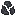
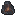
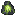
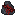
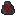

# Catalyze Mod — State of the Mod Report 13-04-26

---

## Overview

**Catalyze** is a NeoForge mod that introduces a **catalyst system** — a smithing-table-based upgrade path that applies unique gameplay effects to existing weapons and tools without replacing them. Effects are stored as NBT flags inside `CustomData` on the item, allowing any vanilla item to be augmented in-place.

---

## Registered Items

### Weapon Catalysts
Applied via a **Combat Template** at the smithing table. Currently craftable using a Dormant Catalyst in the center of standard shape patterns.

| Item ID | Effect Granted | Crafting Recipe (Surrounding Items) |
|---|---|---|
| `blazing_catalyst` | Sets target on fire for 5 seconds | 4x Blaze Rod (Cross pattern) |
| `freezing_catalyst` | Freezes the target (300 ticks) | 4x Blue Ice (Cross pattern) |
| `venomous_catalyst` | Applies Poison I (3 seconds) | 4x Poisonous Potato (Cross pattern) |
| `blinding_catalyst` | Applies Blindness I (1 second) | 4x Echo Shard (Cross pattern) |
| `serrated_catalyst` | Applies Bleeding (with armor-scaled bonus chance) | 4x Rotten Flesh (Cross pattern) |

### Special Catalysts
Applied via a **Special Template** on specific weapons only.

| Item ID | Effect Granted | Restriction | Crafting Recipe |
|---|---|---|---|
| `blood_reaper_catalyst` | Pulls target toward attacker on hit, allows shooting blood projectiles | Netherite Scythe only | Rotten Flesh (top), Iron Ingots (sides), Red Dye (bottom) |
| `piercing_catalyst` | Trident pierces unlimited entities | Trident only | 4x Prismarine Shard + 2x Prismarine Crystals |
| `throat_slit_catalyst` | *(Registered, not yet implemented)* | Arm blades only | Uncraftable |
| `tether_catalyst` | *(Registered, not yet implemented)* | Grappling Hook only | Uncraftable |
| `shattering_catalyst` | *(Registered, not yet implemented)* | Mace only | Uncraftable |

### Tool Catalysts
Applied via a **Tool Template** at the smithing table.

| Item ID | Effect Granted | Crafting Recipe |
|---|---|---|
| `haste_catalyst` | *(Registered; NBT tag `haste` set, tooltip shown — in-game haste logic pending)* | 4x Golden Carrot (Cross pattern) |

### Armor Catalysts
All currently **registered only**, with no in-game effects yet implemented.

| Item ID |
|---|
| `resilience_catalyst` |
| `perception_catalyst` |
| `titan_skin_catalyst` |
| `agility_catalyst` |
| `heavy_weight_catalyst` |

### Templates
Used as the required template slot in smithing recipes.

| Item ID | Used For |
|---|---|
| `combat_template` | All swords, axes, scythe, trident, mace |
| `special_template` | Blood Reaper (Scythe), Piercing (Trident) |
| `armor_template` | *(Registered, not yet used)* |
| `tool_template` | All pickaxes, axes, shovels, hoes |
| `dormant_catalyst` | Base form of a catalyst (crafted into specific catalysts) |

---

## Visual Crafting Guide

Below are the exact 3x3 crafting grid layouts needed to forge each catalyst. All recipes require a single `` **Dormant Catalyst** located in the center.

### 🟠 Blazing Catalyst

| | | |
|:---:|:---:|:---:|
| |  | |
|  |  |  |
| |  | |

**➡ Yields:**  **Blazing Catalyst**

### 🔵 Freezing Catalyst

| | | |
|:---:|:---:|:---:|
| |  | |
|  |  |  |
| |  | |

**➡ Yields:**  **Freezing Catalyst**

### 🟢 Venomous Catalyst

| | | |
|:---:|:---:|:---:|
| |  | |
|  |  |  |
| |  | |

**➡ Yields:**  **Venomous Catalyst**

### 🕳️ Blinding Catalyst

| | | |
|:---:|:---:|:---:|
| |  | |
|  |  |  |
| |  | |

**➡ Yields:**  **Blinding Catalyst**

### ⚫ Serrated Catalyst

| | | |
|:---:|:---:|:---:|
| |  | |
|  |  |  |
| |  | |

**➡ Yields:**  **Serrated Catalyst**

### 🩵 Piercing Catalyst

| | | |
|:---:|:---:|:---:|
| |  | |
|  |  |  |
| |  | |

**➡ Yields:**  **Piercing Catalyst**

### 🌕 Haste Catalyst

| | | |
|:---:|:---:|:---:|
| |  | |
|  |  |  |
| |  | |

**➡ Yields:**  **Haste Catalyst**

### 🩸 Blood Reaper Catalyst

| | | |
|:---:|:---:|:---:|
| |  | |
|    |  |  |
| |  | |

**➡ Yields:**  **Blood Reaper Catalyst**

### Custom Weapons

| Item | Class | Stats | Recipe | Mechanics |
|---|---|---|---|---|
| `netherite_scythe` | `NetheriteScytheItem extends SwordItem` | Netherite tier, +5.5 ATK, -2.7 ATK SPD | 2 Netherite Ingots + 3 Sticks (shaped) | Can be augmented to fire `blood_projectile` if it has the `blood_reaper` catalyst across a 20s cooldown. |
| `blood_projectile_debug` | `BloodProjectileDebugItem` | N/A | None (Debug Only) | Right-click to manually spawn a testing Blood Projectile. |

---

## Entities & Projectiles

### `blood_projectile`
A custom high-performance projectile designed for precision and visual clarity, primarily used by the **Netherite Scythe** when combined with the **Blood Reaper** catalyst (20-second active cooldown via generic Minecraft item cooling).

- **Movement & Physics**:
  - **Speed**: Optimized to **15 blocks/s** (0.75 blocks/tick).
  - **Zero Gravity**: Moves in a perfectly straight line according to the shooter's pitch and yaw.
  - **Smooth Sync**: Logic runs natively on both client and server to eliminate jitter/teleporting.
  - **Hitbox**: Standardized **0.5 x 0.5** for reliable collision detection.
- **Combat**:
  - **Damage**: Balanced to deal approximately **13.0 damage** (6.5 hearts).
  - **Behavior**: Disappears immediately upon hitting a block or entity.
- **Visuals & Audio**:
  - **Spawn Sound**: Randomizes between 3 specialized `blood_spewing` audio files locally fired on instantiation.
  - **Impact Sound**: Squishy `blood_projectile_hit` audio played dynamically exactly at the collision point using custom higher volume bounds.
  - **Animations**: A trailing stream of **Blood Bubble** particles (`blood_bubble_0` -> `blood_bubble_4`) emits softly behind the projectile as it flies directly across the action plane.
- **Rendering**:
  - **Pixel-Perfect Mapping**: Custom quad renderer maps a **32x32** texture onto a flat proportional plane, rotated dynamically `-90°` around its Y-axis for accurate viewing from all slicing motions.

---

## The Catalyst System

### How It Works

1. **Crafting**: Unique component modifiers are constructed using a `Dormant Catalyst` wrapped in specified target ingredients along a 3x3 table.
2. **Recipe**: A custom `CatalystSmithingRecipe` (extends `SmithingTransformRecipe`) is then used at the smithing table with a **Template + Weapon/Tool + Catalyst**.
3. **Assembly**: The recipe's `assemble()` method copies the base item and writes a boolean NBT flag into `CustomData` under the `catalyze_mod` compound key, e.g.:
   ```json
   { "catalyze_mod": { "blazing": true } }
   ```
4. **Effect Trigger**: On hit (or on right-click for special mechanics like the Scythe), Mixins and item overriding methods check these native flags to trigger the requested logic.

A catalyst **overwrites** any previous catalyst data (only one catalyst per item at a time).

---

## Combat Effect Coverage (Weapon Compatibility)

| Effect | Swords | Axes | Netherite Scythe | Trident (melee) | Mace |
|---|:---:|:---:|:---:|:---:|:---:|
| Blazing | ✅ | ✅ | ✅ | ✅ | ✅ |
| Freezing | ✅ | ✅ | ✅ | ✅ | ✅ |
| Venomous | ✅ | ✅ | ✅ | ✅ | ✅ |
| Blinding | ✅ | ✅ | ✅ | ✅ | ✅ |
| Serrated | ✅ | ✅ | ✅ | — | — |
| Blood Reaper | — | — | ✅ | — | — |
| Piercing | — | — | — | ✅ | — |

---

## Custom Effects

### Bleeding (`ModEffects.BLEEDING`)
A fully custom `MobEffect` with **scaling damage and speed**.

- **Damage formula**: `1.5^amplifier` per tick (e.g. Level 1 = 0.5 hearts, Level 2 = 0.75 hearts)
- **Tick interval formula**: `60 / 1.5^amplifier` — higher levels deal damage faster
- **Immune entities** (hardcoded + tag-driven):
  - Iron Golem, Snow Golem, Shulker, Blaze, Breeze, Magma Cube, Slime, Guardian, Elder Guardian, Vex, Allay
  - Plus any entity tagged with `catalyze_mod:immune_to_bleeding`

### Serrated Catalyst — Armor Scaling
The `serrated` effect has a **bonus chance** to upgrade Bleeding to Level 2, reduced by the target's armor:

| Armor Pieces | Bonus Chance |
|---|---|
| 0 | 30% |
| 1 | 25% |
| 2 | 18% |
| 3 | 10% |
| 4 | 2% |

---

## Piercing Trident (Special Mechanic)
`ThrownTridentMixin` is the most complex mixin in the codebase. When a trident has the `piercing` flag:
- Sets pierce level to **127** (functionally infinite) on every tick
- Overrides `onHitEntity` to handle damage manually, skipping Endermen
- Maintains vanilla's `piercingIgnoreEntityIds` set to prevent multi-hitting
- Restores **Channeling** behavior — manually spawns lightning even through pierce
- Sets `dealtDamage = true` on block hit, ensuring **Loyalty** still returns the trident

---

## VFX & Audio Systems

### Particles
- **Bleeding Effect**: Entities affected by Bleeding continuously emit falling blood particles. Scaled by amplifier level.
- **Blood Bubbles**: A new `BLOOD_BUBBLE_PARTICLE` emits behind the blood projectile's flight path. Managed purely on the client with zero gravity logic inside its own generic provider class, directly fetching states from `blood_bubble_particle.json`.

### Custom Sound System 
A robust foundation for adding unique audio dynamically.
- **Registry**: `ModSounds.java` centralizes all `.ogg` mappings implicitly calling events.
- **Variations**: The `blood_spewing` event is properly configured to randomly fetch between 3 individual source pitches (`blood_spewing_0`, `scythe_spewing_1`, `scythe_spewing_2`) dynamically via core JSON arrays.
- **Native Implementation**: Fully suppresses standard arrow and attack `thwacks` over specialized generic events allowing zero overlap.

---

## Tooltip System

Items with any active catalyst show animated tooltips:
- **Default**: Shows a shimmering gold "**(Hold Shift)**" hint
- **Shift-held**: Shows each active catalyst's name with a **color-specific animated gradient**

Gradient color palettes:

| Catalyst | Gradient Colors |
|---|---|
| Blazing | 🟠 Orange → Red → Gold |
| Freezing | 🔵 White → Ice Blue → Teal |
| Venomous | 🟢 Olive → Lime → Bright Green |
| Blinding | 🕳️ Teal → Dark Navy → Near Black |
| Serrated | ⚫ Gray → Dark Red → Deep Crimson |
| Piercing | 🩵 Cyan → Turquoise → Light Cyan |
| Haste | 🌕 Gold → Yellow → Bright Yellow |
| Blood Reaper | 🩸 Dark Red → Very Dark Red → Near Black |

`TextUtil.createAnimatedGradientComponent()` interpolates between colors using a time-based triangular wave, creating a smooth, animated shimmer per character.

---

## Datagen & Crafting Codec

All crafting shapes and catalyst smithing recipes are handled programmatically via `ModRecipeProvider`:
- `addCatalystCraftingRecipes()` & `ShapedRecipeBuilder` — Constructs central `dormant_catalyst` recipes directly into game memory without static definitions.
- `addCatalystRecipes()` — Loops over all targeted weapon models and binds templates directly.
- Recipe IDs follow standard forge taxonomy: `catalyze_mod:<prefix>_<item_path>`

---

## Remaining Unimplemented Items

| Item | Status |
|---|---|
| `throat_slit_catalyst` | Registered, no recipe or effect |
| `tether_catalyst` | Registered, no recipe or effect |
| `shattering_catalyst` | Registered, no recipe or effect |
| All Armor Catalysts | Registered, no recipes or effects |
| `haste_catalyst` | Registered, recipe exists, tooltip exists, but in-game haste effect not applied |
| `blocks` package | Empty directory, no custom blocks defined |
| `event` package | Listed but appears empty |

---

## Adding a New Catalyst — Developer Guide

Every catalyst follows the same 5-step pattern. Here's a complete walkthrough using a hypothetical **Shocking Catalyst** as an example.

---

### Step 1 — Register the Item (`ModItems.java`)

Add a `DeferredItem` entry in the appropriate category block:

```java
// Weapon Catalysts
public static final DeferredItem<Item> SHOCKING_CATALYST = ITEMS.register("shocking_catalyst",
        () -> new Item(new Item.Properties()));
```

Choose a template based on scope:
- `COMBAT_TEMPLATE` → applies to all swords, axes, scythe, trident, mace
- `SPECIAL_TEMPLATE` → applies to one specific weapon
- `TOOL_TEMPLATE` → applies to pickaxes, shovels, hoes, axes
- `ARMOR_TEMPLATE` → intended for armor pieces

---

### Step 2 — Generate the Recipe (`ModRecipeProvider.java`)

**Option A — Standard combat weapon coverage** (swords, axes, scythe, trident, mace):

Add your catalyst to the `buildRecipes()` call to `addCatalystRecipes()`:

```java
addCatalystRecipes(recipeOutput, ModItems.COMBAT_TEMPLATE.get(),
        ModItems.SHOCKING_CATALYST.get(), "shocking");
```

This automatically generates smithing recipes for every sword tier, axe tier, the Netherite Scythe, trident, and mace. The recipe ID will be `catalyze_mod:shocking_<item_path>`.

**Option B — Specific weapon only** (like Blood Reaper or Piercing):

Call `catalystSmithing()` directly with the exact base item:

```java
catalystSmithing(recipeOutput,
        ModItems.SPECIAL_TEMPLATE.get(),   // template
        Items.BOW,                          // base item
        ModItems.SHOCKING_CATALYST.get(),   // catalyst
        Items.BOW,                          // result (same item)
        "shocking_catalyst_bow");           // unique recipe ID
```

> ⚠️ The result item is the **same as the base** — the recipe copies the item and writes NBT data; it does not create a new item type.

---

### Step 3 — Implement the Hit Effect (Mixin)

Add a check for your NBT flag inside the relevant mixin's `hurtEnemy` injection. For a general weapon effect, add it to **all four** weapon mixins (`SwordItemMixin`, `DiggerItemMixin`, `MaceItemMixin`, `TridentItemMixin`):

```java
if (modTag.getBoolean("shocking")) {
    // Example: summon lightning at the target
    if (target.level() instanceof ServerLevel serverLevel) {
        LightningBolt bolt = EntityType.LIGHTNING_BOLT.create(serverLevel);
        if (bolt != null) {
            bolt.moveTo(target.position());
            serverLevel.addFreshEntity(bolt);
        }
    }
}
```

**To restrict an effect to a specific weapon**, wrap the check with an `instanceof` guard. Example — scythe only (inside `SwordItemMixin`):

```java
if (stack.getItem() instanceof NetheriteScytheItem) {
    if (modTag.getBoolean("shocking")) {
        // scythe-only logic
    }
}
```

> The NBT key **must exactly match** the string used in `CatalystSmithingRecipe.assemble()` (Step 4).

---

### Step 4 — Wire Up the NBT Tag (`CatalystSmithingRecipe.java`)

In `assemble()`, add an `else if` branch mapping your catalyst item to your NBT key string:

```java
else if (addition.is(ModItems.SHOCKING_CATALYST.get()))
    tagKey = "shocking";
```

This is the bridge between the smithing recipe and the runtime effect — when the player crafts the upgrade, the item receives `{ "catalyze_mod": { "shocking": true } }`.

---

### Step 5 — Add the Tooltip (`ModClientEvents.java`)

Define gradient colors in the `switch` block inside `onItemTooltip()`:

```java
case "shocking" -> new int[] { 0xFFFF00, 0xFFD700, 0xFFF5B2 }; // Yellow → Gold → Pale Yellow
```

Then add a translation key to your lang file (`en_us.json`):

```json
"tooltip.catalyze_mod.shocking": "⚡ Shocking\nStrikes targets with lightning on hit."
```

The tooltip automatically shows when the player holds **Shift** while hovering over a catalyzed item. Multi-line tooltips are supported using `\n`.

---

### Checklist Summary

| Step | File | What to do |
|---|---|---|
| 1 | `ModItems.java` | Register `DeferredItem` |
| 2 | `ModRecipeProvider.java` | Call `addCatalystRecipes()` or `catalystSmithing()` |
| 3 | Mixin file(s) | Add `modTag.getBoolean("your_key")` check |
| 4 | `CatalystSmithingRecipe.java` | Add `else if` for your item → tag key mapping |
| 5 | `ModClientEvents.java` + `en_us.json` | Add gradient colors and translation string |

---

## Architecture Summary

```
Catalyze_mod (main entry)
├── ModItems       — All item registrations
├── ModRecipes     — Custom recipe type + serializer
├── ModEffects     — Bleeding effect
├── ModParticleTypes — Blood particle
├── ModLootModifiers — (Global loot modifiers, registered)
├── ModCreativeTabs — Creative tab
│
├── datagen/
│   ├── ModRecipeProvider    — Programmatic recipe generation
│   └── ModGlobalLootModifierProvider
│
├── mixins/
│   ├── SwordItemMixin       — Sword + Scythe catalyst effects
│   ├── DiggerItemMixin      — Axe catalyst effects
│   ├── MaceItemMixin        — Mace catalyst effects
│   ├── TridentItemMixin     — Trident melee catalyst effects
│   ├── ThrownTridentMixin   — Thrown trident (piercing + channeling)
│   ├── LivingEntityMixin    — (Registered in mixins.json)
│   ├── MobEffectInstanceMixin — (Registered in mixins.json)
│   └── AbstractArrowAccessor — Accessor for piercing logic
│
├── events/
│   ├── ModClientEvents      — Tooltips + Blood projectile renderer registration
│   └── ModCommonEvents      — Bleeding particle spawn on entity tick
│
├── sounds/
│   └── ModSounds            — Sound registry
│
└── util/
    ├── TextUtil             — Animated gradient text
    ├── ModTags              — Entity type tags (immune_to_bleeding)
    └── ModKeyBindings       — (Registered, purpose TBD)
```
